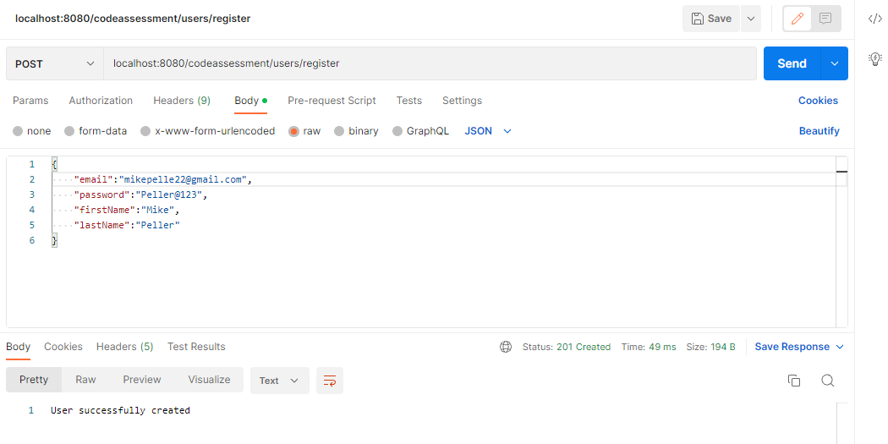
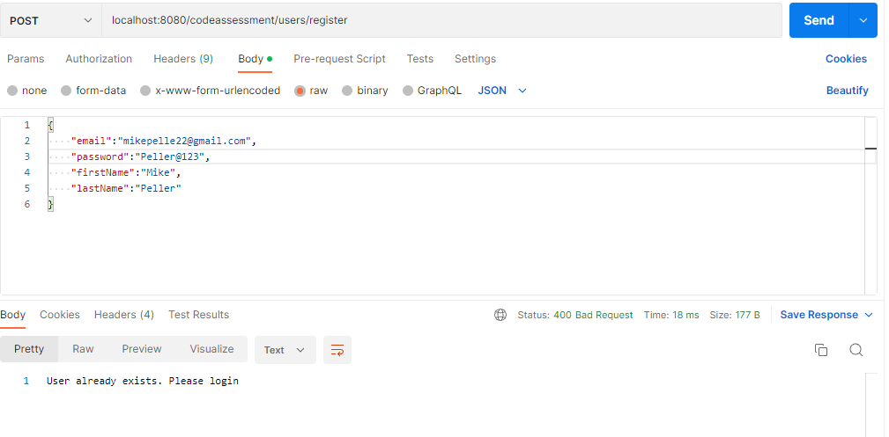
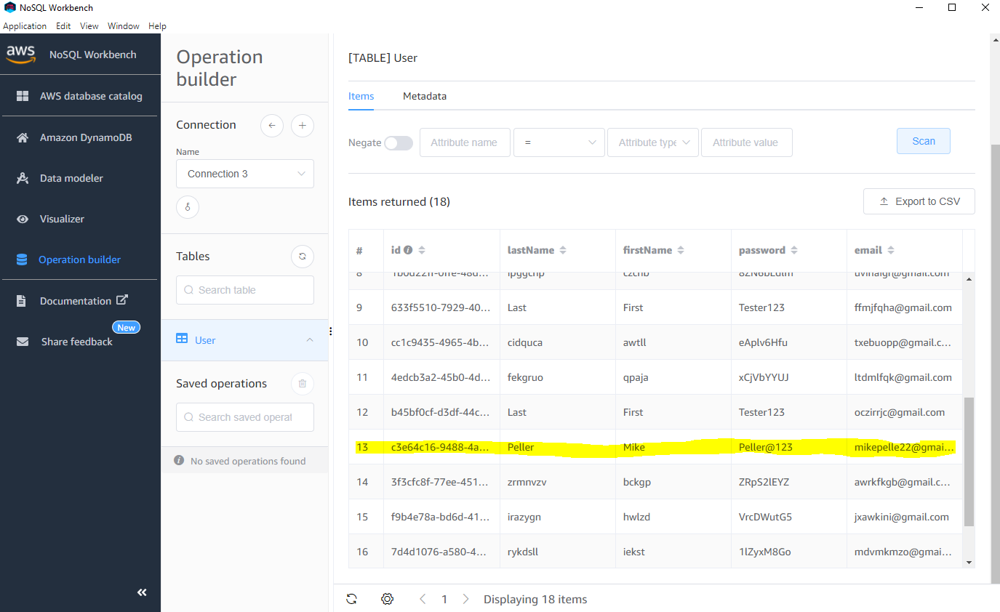
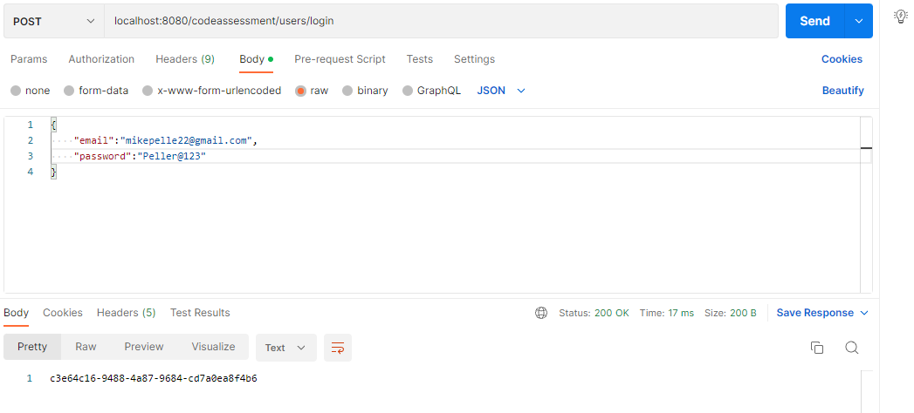
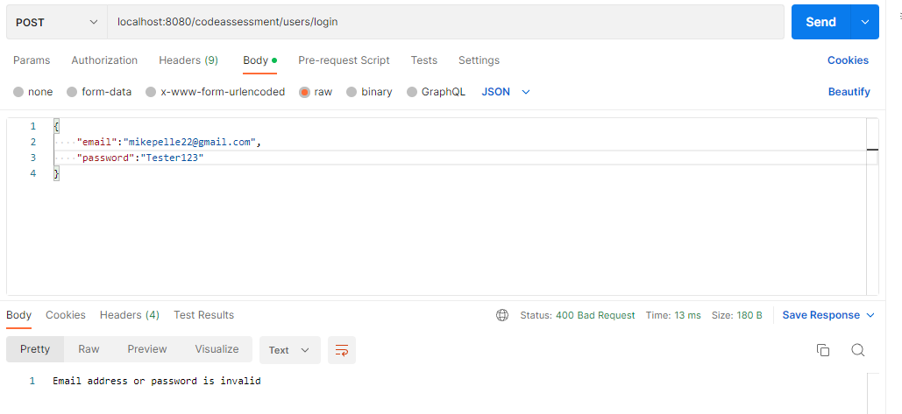
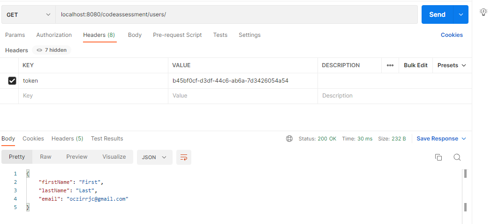
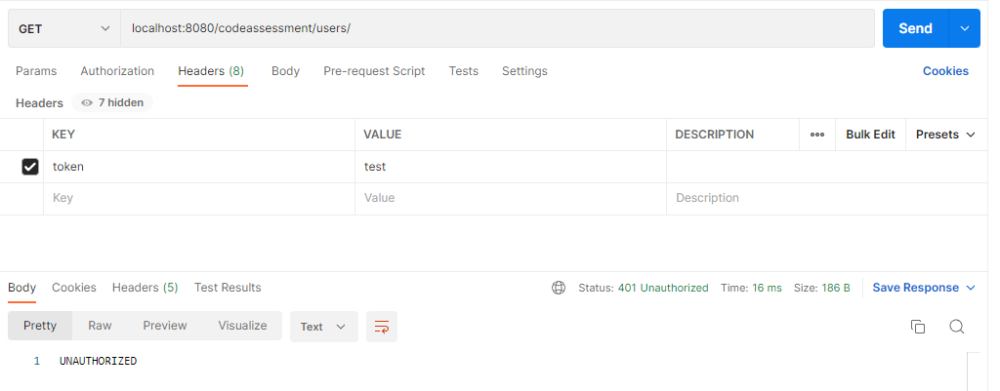
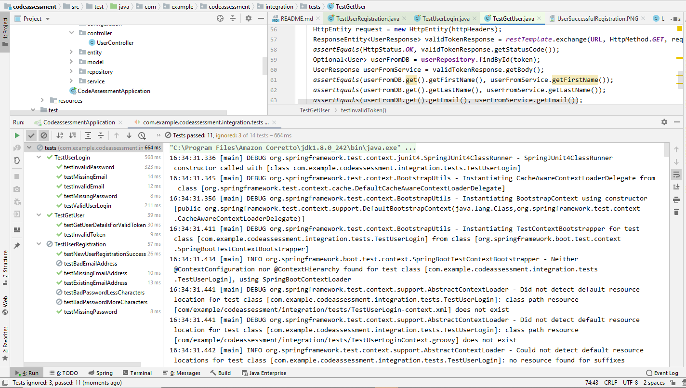

# User Registration and Login Application
This application utilizes RESTful API to perform create and read operations, enabling the storage and retrieval of user information in a DynamoDB table. Additionally, it incorporates integration tests that validate the functionality of the REST APIs against DynamoDB, leveraging the capabilities of the Spring Data DynamoDB framework.

## Getting Started

### Setup Amazon DynamoDB in local

`*` Download Amazon Dynamo DB in local from AWS official documentation - https://docs.aws.amazon.com/amazondynamodb/latest/developerguide/DynamoDBLocal.html

`*` Use below command in terminal to start dynamo DB in local -
```
java -Djava.library.path=./DynamoDBLocal_lib -jar DynamoDBLocal.jar -sharedDb -inMemory

C:\Users\alakhotiya\MyProjects\dynamodb_local_latest>java -Djava.library.path=./DynamoDBLocal_lib -jar DynamoDBLocal.jar -sharedDb -inMemory
Initializing DynamoDB Local with the following configuration:
Port:   8000
InMemory:       true
DbPath: null
SharedDb:       true
shouldDelayTransientStatuses:   false
CorsParams:     null
```

### Setup NoSQL workbench for DynamoDB

Install NoSQL workbench from below link
https://docs.aws.amazon.com/amazondynamodb/latest/developerguide/workbench.html

`*` After Installation is done, Open NoSQL Workbench.

`*` Create new data model - UserDataModel. Provide name and Description and Click on create.

`*` Click on 'Data Modeler' and then click on '+' to add tables.

`*` Enter the Table Name - User and Primary Key - Id and Other Attributes - firstName, lastName, email, password.

`*` Go to the 'Visualizer' and Click on 'Commit to Amazon DynamoDB'. 

`*` Select the 'default' under 'Use saved connection' and Click Commit.

### Running application locally

`*` Open the code assessment application in IntelliJ IDE.

`*` Replace the accesskey and secretkey values with credentials from local instance of DynamoDB in application.properties file.

`*` Run mvn clean install command.

`*` Now run the application locally - by default application will run on port 8080.

`*` Use the below end points in postman to register and login user.

## Rest API Details 

### Register User 
This end point registers a new user by inserting a record in dynamoDB. If the email already exists, user is asked to login.
```
End point - http://localhost:8080/codeassessment/users/register
Http method - POST
Sample Payload - {
                     "email":"mikepelle23@gmail.com",
                     "password":"Peller@123",
                     "firstName":"Mike",
                     "lastName":"Peller"
                 }

```
#### Postman 
Execute post call using Postman to register new user.



If users email exists, don't store in DB and give error



#### DynamoDB 
Newly created user saved to database. 




### Login User
This endpoint authenticates user and returns a token.
```
End point - http://localhost:8080/codeassessment/users/login
Http method - POST
Sample Payload - {
                     "email":"mikepelle22@gmail.com",
                     "password":"Peller@123",
                 }

```
#### Postman 
Valid login details - Execute post call using Postman to get token for requested user.



Invalid login details




###  Get User Details
This end point returns the user details based on the token passed in request headers.

```
End point - http://localhost:8080/codeassessment/users/login
Http method - GET
Http headers - token:{{tokenValue}}
```
#### Postman 
Valid token - User gets the details



Invalid token - User gets unauthorized error



## Automation Scripts

Please find the integration test-cases below for testing RESTful api functionality. 

### Test Cases For User Registration

Sno. | Test Case  | Status Code | Response | 
--- | --- | --- | --- |
1 | User with valid email, password, firstname, lastname should be able to register and record should be added to User table in dynamoDB | 201 | User successfully created |
2 | Already registered user should get error while registration | 400 | User already exists. Please login |
3 | Missing Email address during registration | 400 | Provide valid email address |
4 | Missing password during registration | 400 | Provide valid password between 8-20 characters |
5 | Invalid Email that doesn't have @ and domain should give error | 400 |  Provide valid email address |
6 | Invalid password less than 8 characters | 400 |  Provide valid password between 8-20 characters |
7 | Invalid password more than 20 characters | 400 |  Provide valid password between 8-20 characters |

### Test Cases For Login

Sno. | Test Case  | Status Code | Response | 
--- | --- | --- | --- |
1 | User with valid email and password should be able to login | 200 | token returned for the user |
2 | User with Invalid email should not be able to login | 400 | Email address or password is invalid| 
3 | User with Invalid password should not be able to login | 400 | Email address or password is invalid | 
4 | User with Missing email address in payload should not be able to login | 400 | Provide valid email address | 
5 | User with Missing password in payload should not be able to login | 400 | Provide valid password | 

### Test Cases For Getting User Details

Sno. | Test Case  | Status Code | Response | 
--- | --- | --- | --- |
1 | User with valid token that is generated after login should be able to retrieve their information | 200 | json response with firstname, lastname and email address verified against db |                                                                                      
2 | User with invalid token should not be able to access their information | 401 | Unauthorized |

### Test case Run

To run the test please start the application and run below command

```
mvn integration-test
```

Below is the screenshot of integration tests run in local. 



### Notes 

`*` I have ignored three tests for password and email validations since my code currently does not handle those scenarios, which could allow bad data to be inserted into the database. Additional test cases can be implemented to sanitize all user inputs, including fields such as first name and last name.
 
`*` To enhance security, a mechanism should be implemented that temporarily blocks a user from obtaining a token after a certain number of consecutive invalid password or email attempts. This prevents potential brute force attacks and unauthorized access.

`*` Test cases should be implemented to validate the users input against SQL and JavaScript injection vulnerabilities.

## Assumptions

`*` In the code, I've made an assumption that the generated ID in the table serves as the token for the user. However, it would be more appropriate to generate tokens using secure methods such as JSON Web tokens or OAuth tokens, which also include an expiration period.

`*` As for storing passwords in the database, I have directly stored them without encryption. It is important to note that this is not considered a best practice. Instead, passwords should be encrypted before being stored to enhance security and protect user information.

`*` The application and database are not currently deployed or hosted in a cloud environment. Instead, the application is running locally using the built-in Tomcat server provided by Spring Boot.

`*` I have not developed a user interface that facilitates calling the RESTful API for user registration and login purposes. Also, unit tests should be added to adhere to testing pyramid.